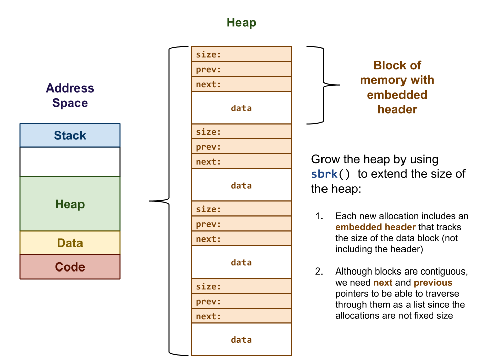
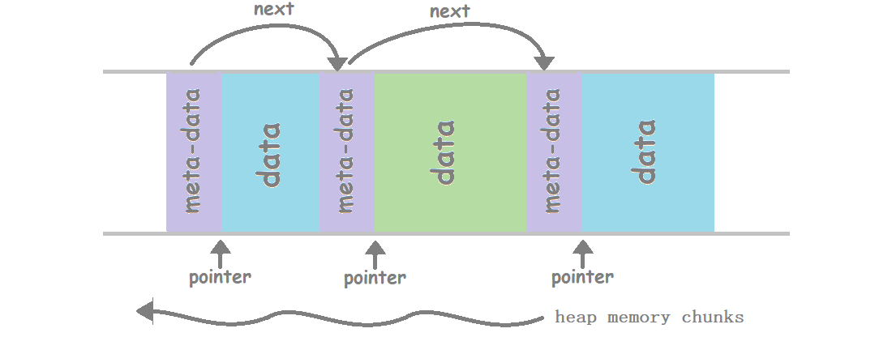
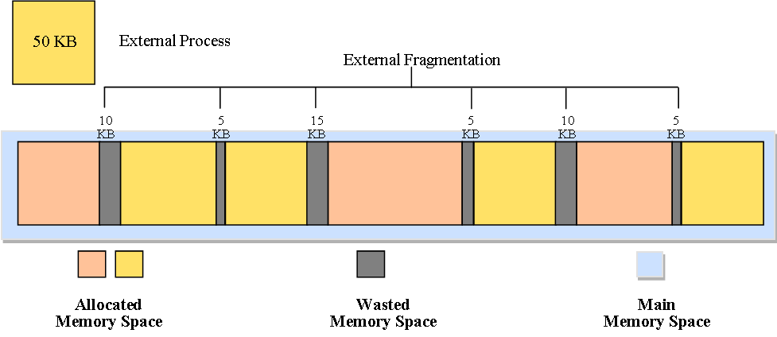

# Dynamic Memory Allocation

| Function | Use                                                                                              |
|:--------:|--------------------------------------------------------------------------------------------------|
|  malloc  | Allocate requested bytes and return pointer to first byte                                        |
|  calloc  | Allocate space for array of elements, initializes them to zero and returns pointer to first byte |
|   free   | frees previously allocated memory                                                                |
|  realloc | modifies size of previously allocated memory                                                     |


## Heap Memory Management

- Heap memory of process is continuous part of virtual address space of process from which a process claims and reclaims memory during runtime (dynamic memory allocation)
- glibc APIs: `malloc`, `calloc`, `free`, `realloc`
- system calls: `brk`, `sbrk`, `mmap`, `munmap`
- Stack memory is reclaimed back upon procedure returns. But it is programmers reposibility to free heap memory.



>- On a Unix-like system, your program's address space consists of **one or more virtual memory regions**, each of which is mapped by the OS to physical memory, to a file, or to nothing at all.
> - **The heap is, generally speaking, one specific memory region created by the C runtime**, and managed by `malloc` (which in turn uses the `brk` and `sbrk` system calls to grow and shrink).
>- `mmap` is a way of creating new memory regions, independently of `malloc` (and so independently of the heap). `munmap` is simply its inverse, it releases these regions.

### break pointer

- The end of the heap is marked by a pointer known as the "break" / "break pointer". When the heap manager needs more memory, it can push the break further away using the system calls `brk` and `sbrk`.

### meta block & data block

- meta block stores info about data block. each data block, there is associated meta block before it.

```c
typedef struct metadata {

  size_t size;
  struct metadata* next;
  struct metadata* prev;

} metadata_t;
```



### How `malloc()` and `free()` works?

- `malloc` is standard C library function that allocates memory chunks from process's virtual address space, particularly from heap memory segment.

## fragmentation & its solution

### Internal Fragmentation


- When the memory assigned to a process is larger than the memory requested by the process.
- internal fragmentation can be decreased by effectively allocating the littlest partition but sufficient for the process. 

### External Fragmentation



- total space available in memory is sufficient to execute the process; however, this memory space is not contiguous
- (compaction) all the contents of the memory are manipulated and all the free memory is put together in a big block.

## References

[[00] https://www3.nd.edu/~pbui/teaching/cse.30341.fa18/project04.html](https://www3.nd.edu/~pbui/teaching/cse.30341.fa18/project04.html)

[[01] memory fragmentation](https://er.yuvayana.org/memory-fragmentation-in-operating-system/)

