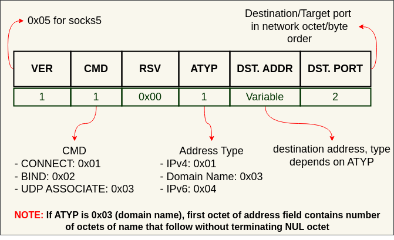
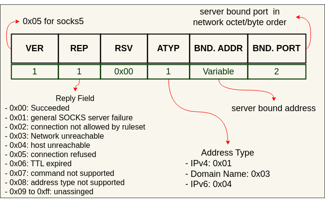

# Socks5

## TCP based clients

### Step 1: Method Selection

- **Client connects to server**, and sends a method selction message

- **Server responds** with selected method

### Step 2: Method dependent negotiations

#### Username/Password negotiations

### Step 3: Request/Response

#### Request

#### Reply

- **CONNECT**
  - `BND.PORT` contains port number that server assigned to connect to target host while `BND.ADDR` contains associated IP address.

- **BIND**
  - It is used in protocols which require client to accept connections from server.
  - It is used by the client to request the SOCKS server to **listen on a specific port** and wait for an incoming connection from a target host. The server waits for an incoming connection on the specified port and relays data between the client and the target once the connection is established.
  - Two replies are sent from the SOCKS server to the client during a BIND operation.  The first is sent after the server creates and binds a new socket.  The BND.PORT field contains the port number that the SOCKS server assigned to listen for an incoming connection.The BND.ADDR field contains the associated IP address.  The client will typically use these pieces of information to notify (via the primary or control connection) the application server of the rendezvous address.  The second reply occurs only after the anticipated incoming connection succeeds or fails. In the second reply, the BND.PORT and BND.ADDR fields contain the address and port number of the connecting host.

- **UDP ASSOCIATE**
  - In this, SOCKS server assigns a port to the client, which the client can then use as a source port for sending UDP datagrams. The server relays UDP packets between the client and the target host. This command allows UDP-based applications to use the SOCKS proxy for communication.
  - A UDP association terminates when the TCP connection that the `UDP ASSOCIATE` request arrived on terminates.

## References

[[00] SOCKS Protocol Version 5](https://www.rfcreader.com/#rfc1928)

[[01] Username/Password Authentication for SOCKS V5](https://www.rfcreader.com/#rfc1929)
