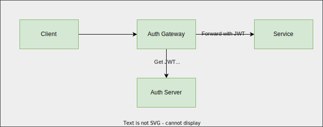

# hmac auth



## Installing cURL

```sh
# first install luarocks (package manager)
sudo apt-get install libcurl4-openssl-dev
sudo apt-get install luarocks

# install cURL
sudo luarocks install lua-curl

## Troubleshoot
# If fails with error, curl.h not found
sudo luarocks install lua-curl CURL_INCDIR=/usr/include/x86_64-linux-gnu/
```

## Installing resty hmac

[https://github.com/jkeys089/lua-resty-hmac/blob/master/lib/resty/hmac.lua](https://github.com/jkeys089/lua-resty-hmac/blob/master/lib/resty/hmac.lua)

## Installing resty http

[https://github.com/ledgetech/lua-resty-http/tree/master/lib/resty](https://github.com/ledgetech/lua-resty-http/tree/master/lib/resty)