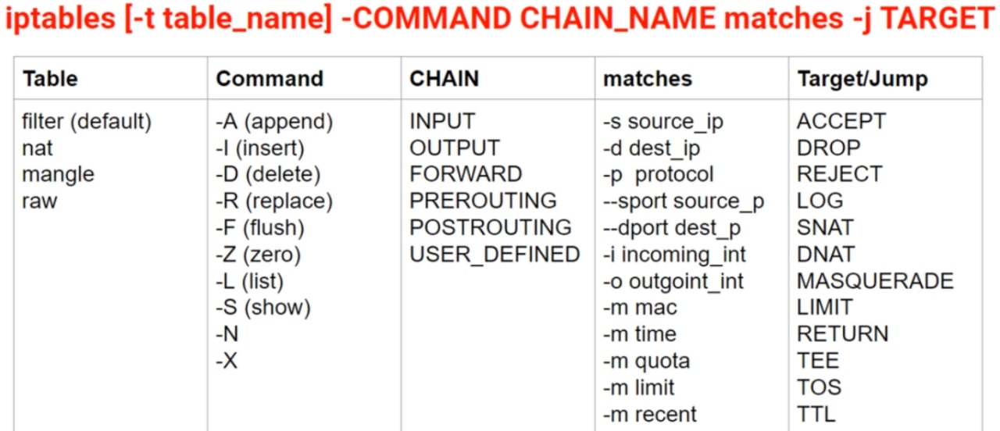

# iptables

## Introduction

### firewall

It is a network security system monitors and control incoming and outgoing based on predetermined security rules. It typically establishes a barrier between trusted internal networks and untrusted external networks.

### netfilter

firewall solution for linux is netfilter. It is inside linux kernel so all linux based systems already has it. It enables **packet filtering, NAT, PAT, Port forwarding, packet mangling etc**. It is controlled by `iptables` command. Netfilter belongs to kernels space while iptables belongs to user-space.

### Packet Process

- Every packet is inspected by firewall rules. Firewall rules determine what traffic your firewall allows and what is blocked.
- The iptables firewall uses **tables** to organize its rules.
- within each iptables table, rules are further organized within separate **CHAINS**. *Rules are placed within a specific chain of a specific table*.
- within a chain,  a packet starts at the top of the chain and is matched rule by rule.
- when a match is found the target is executed.
- A target is the action that is triggered when a packet meets the matching criteria of the rule. If the target is terminating no other rule will evaluate the packet.

$$iptables  \rightarrow Tables  \rightarrow Chains  \rightarrow Rules$$

## Built in tables and chains

### In-built chains
- **INPUT**: used for filtering *incoming packets*. our host is packet destination.
- **OUTPUT**: used for filtering *outgoing packet*. Our host is the source of the packet.
- **FORWARD**: used for filtering *routed packets*. our host is router.
- **PREROUTING**: used for DNAT / port forwarding.
- **POSTROUTING**: used for SNAT (MASQUERADE)

>**NAT (Network Address Translation)** occurs when one of the IP address (Source or Destination) in IP packet header is changed. SNAT (Source address changed) and DNAT (Destination address changed).
>**masquerade** is form of NAT used to perform many-to-one IP address translation.

### In-built tables
- **Filter Table**: it is default table for iptables and has INPUT, OUTPUT, and FORWARD chains.
- **NAT table**: It is specialized for SNAT and DNAT (Part Forwarding) and has PREROUTING, POSTROUTING, and OUTPUT (for locally generated packets) chains.
- **Mangle table**: It is specialized for packet alteration and has PREROUTING, INPUT, OUTPUT, FORWARD and POSTROUTING chains
- **Raw table**: It is only used to set a mark on packets that should not be handled by the connection tracking system. This is done by using NOTRACK target on packet. has PREROUTING and OUTPUT chains.

### Targets

- target is action that is triggered when packet meets matching criteria of rule
- table and chain will dictate TARGET availability.
- targets can be 
  1. **Terminating** like `ACCEPT`, `DROP`, `REJECT`
  2. **Non terminating** like `LOG`, `TEE`

## Commands



### Basic Usage

```sh
# list all chains & rules of all tables
iptables -L

# list all chains & rulees for particular table
iptables -t nat -L

# drop icmp packets (ping will not work)
# add rule to filter table INPUT chain
iptables -t filter -A INPUT -p icmp --icmp-type echo-request -j DROP

# list rule on particular chain
iptables -t filter -vnL INPUT

# block outgoing to google.com
# this will resolve dns and adds ips
iptables -t filter -A OUTPUT -p tcp --dport 80 -d google.com -j DROP
iptables -t filter -A OUTPUT -p tcp --dport 443 -d google.com -j DROP

# delete rule from table chain
iptables -t filter -D OUTPUT -p tcp --dport 443 -d google.com -j DROP
iptables -t filter -D OUTPUT 2 # rule number

# save & restore
iptables-save > myrules
iptables-restore myrules
```

## default policy

- policy specifies what happens to packets that are not matched against any rule.
- by default, policy is set to **accept all traffic**
- policy can be changed only for **INPUT, OUTPUT and FORWARD** chains
- policy can be changed using `-P` option.

```sh
iptables -P INPUT DROP/ACCEPT
```

## Filtering

```sh
# match by ip range (--src-range & --dst-range)
iptables -t filter -A INPUT -m irange --src-range 10.0.0.10-10.0.0.29 -p tcp --dport 25 -j DROP

# match by address type (--src-type & --dst-type)
# UNICAST, MULTICAST, BROADCAST etc
iptables -t filter -A OUTPUT -m addrtype --dst-type MULTICAST -j DROP

# filter by port
# single port 
iptables -A INPUT -p tcp --dport 22 -j DROP

# multiple ports (--sports & --dports)
iptables -A OUTPUT -p tcp -m multiport --dports 80,443 -j ACCEPT

# filter by protocol
# list protocols
cat /etc/protocols

# filter by interface
# -i incoming_interface (only for INPUT, FORWARD, PREROUTING)
# -o outgoing_interface (only for FORWARD, OUTPUT, POSTROUTING)
iptables -A INPUT -i wlan0 -j ACCEPT

# its good practive to permit traffic on loopback interface lo
iptables -A INPUT -i lo -j ACCEPT
iptables -A OUTPUT -i lo -j ACCEPT

# negating matches
# drop if ip not 192.168.0.112
iptables -A INPUT ! -s 192.168.0.112 -p tcp --dport 443 -j DROP
# dropping all communication excepting that with the default gateway (mac is b4:6d:83:77:85:f4)
iptables -A INPUT -m mac ! --mac-source b4:6d:83:77:85:f4 -j DROP

# filter by tcp flags
# SYN, ACK, FIN, RST, URG, PSH etc
# dropping all incoming tcp packets that have syn set
iptables -A INPUT -p tcp --syn -j DROP
 
# logging outgoing traffic that has syn and ack set
iptables -A OUTPUT -p tcp --tcp-flags syn,ack,rst,fin syn,ack -j LOG

# filter by mac address
# only possible by source mac address
iptables -A INPUT -i wlan0 -m mac --mac-source 08:00:28:45:45:20 -j DROP
```

## Stateful Firewall

- connection tracking = ability to maintain state information about connections
- **Packet states**
  - `NEW`: first packet from connection
  - `ESTABLISHED`: packet part of existing connection
  - `RELATED`: packets that are requesting new connection & are already part of existing connection. Eg FTP
  - `INVALID`: packets not part of any existing connection
  - `UNTRACKED`: packets marked withing raw table with `NOTRACK` target

>connection tracking can be used even if the protocol itself is stateless. Ex UDP, ICMP.

```sh
# -m state --state <state>
# host is allowed to connect to outside & then outside can send data
# but outside cant initiate connection.
iptables -A INPUT -m state --state ESTABLISHED,RELATED -j ACCEPT
```

## Connection & Quota Limiting

```sh
# -m connlimit
# --connlimit-upto n : conn less than n
# --connlimit-above n : conn greater than n
iptables -A INPUT -p tcp --dport 25 --syn -m connlimit --connlimit-above 5 -j REJECT --reject-with tcp-rst

# -m limit
# --limit value : max matches per time unit (default second)
# --limit-burst value : max bursts/matches before above limit kicks in (default 5)
iptables -A FORWARD -m limit --limit 1/minute -p udp --dport 53 -j LOG

# allow only 5 new incoming connections per second to port 443 (https) 
iptables -A INPUT -p tcp --dport 443 --syn -m limit --limit 5/sec -j ACCEPT
iptables -A INPUT -p tcp --dport 443 --syn -j DROP

# -m quota --quota bytes
# allow 10MB & then start dropping
iptables -A OUTPUT -d 80.0.0.1 -p tcp --sport 80 -m quota --quota 10000000 -j ACCEPT
iptables -A OUTPUT -d 80.0.0.1 -p tcp --sport 80 -j DROP
```

## Dynamic Database of IPs

```sh
# when a packet is coming, it will be checked against this rule and
# if its source ip belongs to the hacker list, the packet will be dropped
# last seen time is updated with another 60 seconds (the source ip address stays in the list for another 60 seconds)
iptables -A INPUT -m recent --name hackers --update --seconds 60 -j DROP
 
 
# when the 1st matched packet arrives (tcp/25 between 8:00-10:00 UTC), a list named hacker is created,
# the source ip address of the packet is added to that list and the packet is dropped
iptables -A INPUT -p tcp --dport 25 -m time --timestart 8:00 --timestop 10:00 -m recent --name hackers --set -j DROP
```

### ipset

```sh
# create ip set 
ipset -N myset hash:ip

# add ips to ipset
ipset -A myset 1.1.1.1
ipset -A myset 2.2.2.2
ipset -A myset 8.8.8.8

# del entry from set
ipset -D myset 8.8.8.8

# del ipset
ipset -X myset

# remove all entries from set
ipset -F myset
ipset -F  # flush from all sets

# list ipsets with its content
ipset list
ipset -L
ipset -L myset

# drop all packets coming from ipset ips
iptables -A INPUT -m set --match-set myset src -j DROP

# set src ip to ipset using iptables & then drop all from ipset
iptables -I INPUT -p tcp --dport 80 -j SET --add-set myset src
iptables -A INPUT -m set --match-set myset src -j DROP
```

## Advanced Usage

```sh
# TEE target will clone a packet and redirect this clone to another machine on local subnet (traffic mirroring)
iptables -A INPUT -p icmp --icmp-type echo-request -j TEE --gateway 192.168.0.20

# REDIRECT target: redirects from one port to another on same machine
# useful for transparent proxying, where LAN hosts do not know about proxy at all
# REDIRECT only valid within PREROUTING & OUTPUT chains of nat table.
# REDIRECT tcp traffic on port 1234 to port 22
iptables -t nat -A PREROUTING -p tcp --dport 1234 -j REDIRECT --to-ports 22
```

### NAT

- NAT involves rewriting source and/or destination addresses of IP packets as they pass through a router or firewall
- SNAT replaces private IP address from packet with public IP address of router external interface
- netfilter framework enables linux machine with appropriate number of network cards/interfaces to become router capable of NAT
- **SNAT uses nat table & POSTROUTING chain**
- **MASQUERADE** is special case of SNAT used when public IP address of NAT router is dynamic. It will automatically  use IP address of outgoing network interface for network translation
- Whn uses SNAT/MASQUERADE, netfilter also performs port address traslation (PAT) on packet.
- set forwaring `echo "1" > /proc/sys/net/ipv4/ip_forward`

```sh
iptables -t nat -A POSTROUTING -s 10.0.0.0/24 -o eth0 -j SNAT --to-source 80.0.0.1

# or MASQUERADE
iptables -t nat -A POSTROUTING -s 10.0.0.0/24 -o eth0 -j MASQUERADE
```

**Port Forwarding (DNAT)**
- It permits connections from internet to servers with private IP addresses inside LAN.
- The clients connects to public IP address of DNAT router which in turn redirects traffic to private server.
- server with private IP address stays invisible
- DNAT uses nat table & PREROUTING chain
- target used is `-j DNAT --to-destination <private_ip>`

```sh
# Internet clients connect to the public IP address of the router and port 8080 and the packets are 
# redirected to the private server with 192.168.0.20 and port 80
iptables -t nat -A PREROUTING -p tcp --dport 8080 -j DNAT --to-destination 192.168.0.20:80

# On all 5 private servers (192.168.0.20-192.168.0.24)run the same service (e.g. HTTPS)
# The router will pick-up a random private IP from the range and then translate and send (port-forward) the packet to that IP
iptables -t nat -A PREROUTING -p tcp --dport 8080 -j DNAT --to-destination 192.168.0.20-192.168.0.24
```

## References

[[00] https://linux.die.net/man/8/iptables](https://linux.die.net/man/8/iptables)

[[01] Linux Security: The Complete Iptables Firewall Guide - udemy.com](https://www.udemy.com/course/linux-security-the-complete-iptables-firewall-guide/)
