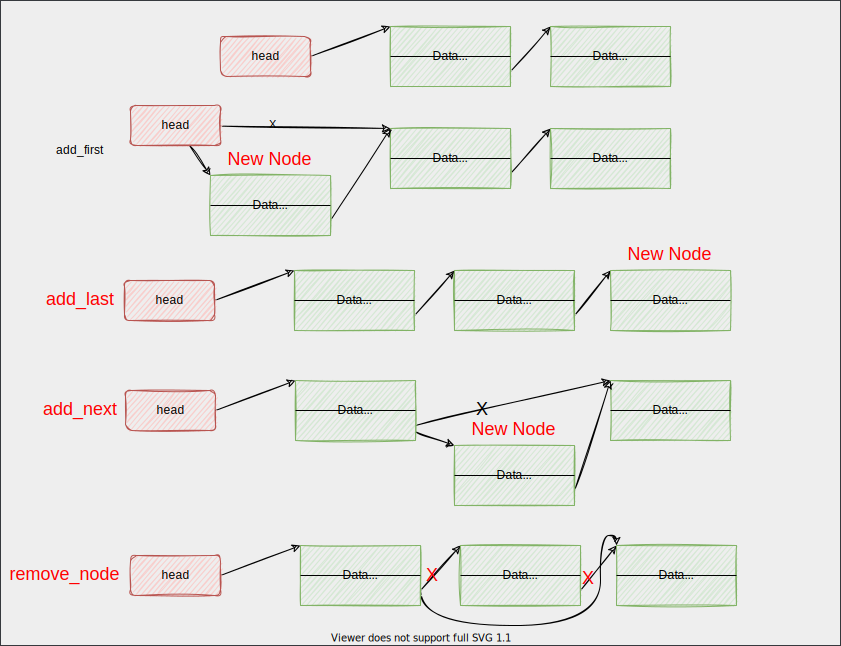

# Singly Linked List



## Operations

```c
void (*add_first) (struct llist_ *self, llist_node *node);
void (*add_last) (struct llist_ *self, llist_node *node);
void (*add_next) (llist_node *nextTo, llist_node *node);
llist_node * (*remove_node) (struct llist_ *self, void *data, int (*fn)(void *data, void *nodeData));
llist_node * (*search) (struct llist_ *self, void *data, int (*fn)(void *data, void *nodeData));
void (*print) (struct llist_ *self, void (*fn) (void *data));
```