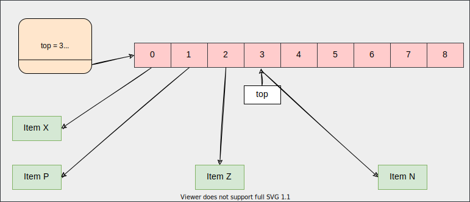

# Stack using array



## Operations

```c
int (*push) (struct stack_ *self, void *item);
void* (*pop) (struct stack_ *self);
void* (*stacktop) (struct stack_ *self);
void (*print) (struct stack_ *self, void (*fn) (void *data));
```