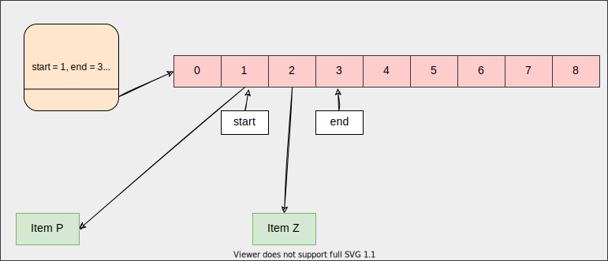

# Queue using array



## Operations

```c
int (*enqueue) (struct queue_ *self, void *item);
void* (*dequeue) (struct queue_ *self);
void* (*front) (struct queue_ *self);
void (*print) (struct queue_ *self, void (*fn) (void *data));
```