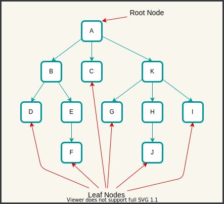

# n ary Trees



## Terminology

- **Root**: 
  - Topmost node in tree which does not have any parent.
  - `A` is root in above image.
- **Nodes & Edges**:
  - Tree is collection of nodes & directed edges.
  - Each node can points to 0 or more nodes using edges.
  - In Image, root node `A` is pointing to `B`, `C`, & `K`.
  - Nodes can have their special names like *root*, *leaf* nodes etc
  - If tree has `n` nodes then that tree must be having `n-1` edges.
- **Parent, Child, Siblings**:
  - Parent, child & Siblings are relationships between nodes. Like we have in real life.
  - Node `E` is Parent of node `F`, child of node `B`, sibling of node `D` at same time.
- **ancestors & descendants**:
  - All nodes from root node to that node are ancestors of that node. Eg. `A`, `B` are ancestors of node `E`.
  - All nodes from that node, down to leaf nodes are descendants of that node. Eg. `G`, `H`, `I`, `J` are descendants of node `K`.
- **Degree of node**: 
  - No of children node has.
  - Eg. Degree of `K` is 3
  - Leaf nodes have degree 0
- **Levels**
  - No of nodes, from root to reach particular node is level of that node (including root & that node)
  - Root node is having level 1.
  - Node `E` is at level 3.
- **height**
  - height of node: `level - 1`
  - height of tree: `max(leaf levels) - 1`
  - height of above tree is `max{L(D), L(F), L(G), L(J), L(I)} - 1` that is `max{3,4,3,4,3} - 1 = 4`

### ADT

#### Using Linked List

```c
typedef struct tnode {
  void *data;
  dll children;
} TreeNode;
```

#### Without Any Container For Children

```c
typedef struct tnode {
  void *data;
  struct tnode *firstChild;
  struct tnode *nextSibling;
} TreeNode;
```