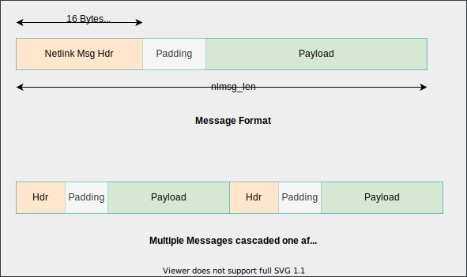

# Netlink

- Communication between *kernel and user* space.
- consists of a standard **sockets-based interface for user space** processes and an **internal kernel API for kernel modules**.
```c
#include <asm/types.h>
#include <sys/socket.h>
#include <linux/netlink.h>

netlink_socket = socket(AF_NETLINK, socket_type, netlink_family);
```
- Netlink is a datagram-oriented service. Both `SOCK_RAW` and `SOCK_DGRAM` are valid values for `socket_type`. However, the netlink protocol does not distinguish between datagram and raw sockets.

>**Datagram sockets**, also known as connectionless sockets, allow the transmission of data to be sent as discrete packets, called datagrams, to other devices on the network. These sockets do not establish a connection with the recipient before sending data and do not guarantee that the data will be delivered.<br><br>
**Raw sockets**, on the other hand, **allow the application to access the underlying protocol headers** and can be used to send packets with arbitrary data in the headers. Raw sockets are typically used for creating custom network protocols or for accessing low-level network information.

- `netlink_family` or netlink protocol number,  selects the kernel module or netlink group to communicate with. Unique id is assigned to each netlink capable kernel subsystem. List can be found [here](https://man7.org/linux/man-pages/man7/netlink.7.html)

- Netlink messages consist of a byte stream with one or multiple `nlmsghdr` headers and associated payload.  The byte stream should be accessed only with the standard `NLMSG_*` macros.

## Netlink Messages



```c
struct nlmsghdr {
  u32 nlmsg_len;   /* total length of msg */
  u32 nlmsg_type;
  u32 nlmsg_flags;

  /* unique seq num for each msg. useful for ack verification */
  u32 nlmsg_seq;

  /* port id. should be unique for application. */
  /* will be 0 for msgs originating from kernel */
  u32 nlmsg_pid;
}
```

- multiple messages can be casceded one after another, both ways (from kernel to user space & vice versa)

### Message Types (nlmsg_type)

- `NLMSG_NOOP`: 0x1
- `NLMSG_ERROR`:0x2
- `NLMSG_DONE`: 0x3
- `NLMSG_OVERRUN`: 0x4 (currently not used in linux kernel anywhere)

>Note: Besides these, user can define his own msg types which should be **>= 16**;

### Message Flags (nlmsg_flags)

- Message flags are set to convey additional information to recipient.
- Multiple flags could be set using bitwise OR operation.

|      **Flag**     |                                          **Notes**                                         |
|:-----------------:|:------------------------------------------------------------------------------------------:|
| **NLM_F_REQUEST** | Must be set on all request messages                                                        |
| **NLM_F_MULTI**   | This message is part of **multipart** message terminated by `NLMSG_DONE`                   |
| **NLM_F_ACK**     | sender asking for Ack from receiver. Replies either `NLMSG_NOOP` or `NLMSG_ERROR` msg type |
| **NLM_F_ECHO**    | Echo this request  |
| **NLM_F_ROOT**    |           |
| **NLM_F_MATCH**   |               |
| **NLM_F_ATOMIC**  |                  |
| **NLM_F_DUMP**    | Give all data of particular type. Replies with `NLM_F_MULTI` |
| **NLM_F_REPLACE** |   |
| **NLM_F_EXCL**    | Used with `NLM_F_CREATE`. return error if resource/conf present. |
| **NLM_F_CREATE**  | Asking kernel subsystem to create resource/conf.|
| **NLM_F_APPEND**  | Add more data to existing conf.  |

## socket buffer

- When kernel space receives data from userspace via Netlink, data is received in a data structure called socket buffer

  ```c
  // defined in include/linux/skbuff.h
  struct sk_buff;
  ```
- Kernel uses this structur for
  1. For transferring messages from one kernel subsystem to another
  2. For receiving network packet
  3. packet movement upwards & downwards in layers of TCP/IP stack.

```c
struct sk_buff *skb_in;

// user space data received i
skb_in->data;

// length of data
skb_in->len;
```

## References

[[01] https://man7.org/linux/man-pages/man7/netlink.7.html](https://man7.org/linux/man-pages/man7/netlink.7.html)

[[02] https://man7.org/linux/man-pages/man3/netlink.3.html](https://man7.org/linux/man-pages/man3/netlink.3.html)

[[03] https://www.udemy.com/course/netlinksockets/](https://www.udemy.com/course/netlinksockets/)

[[04] https://docs.kernel.org/next/userspace-api/netlink/intro.html](https://docs.kernel.org/next/userspace-api/netlink/intro.html)

